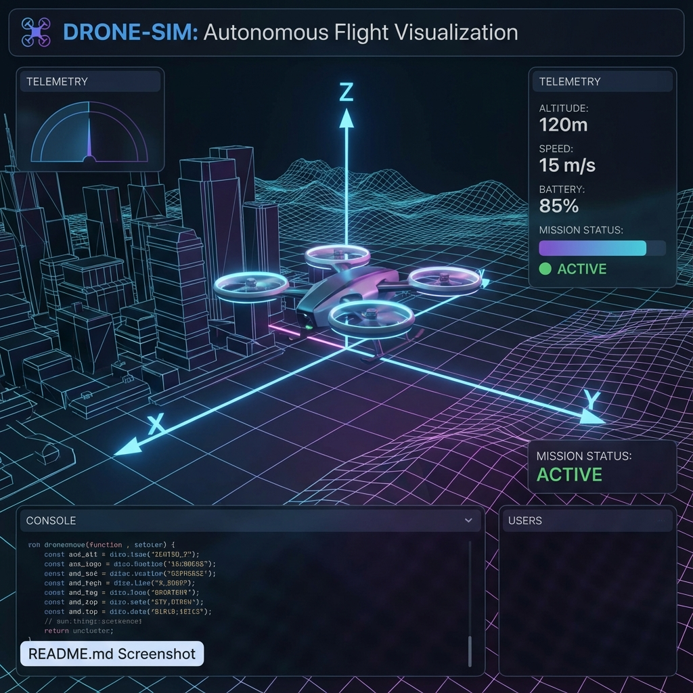
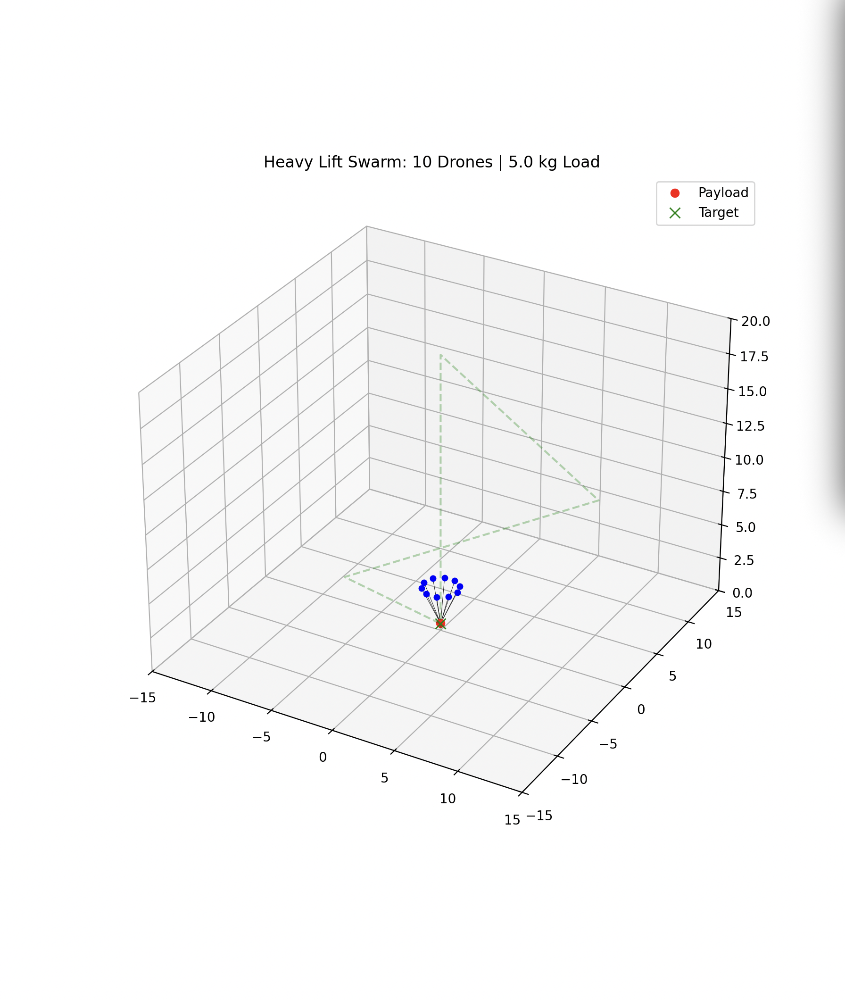
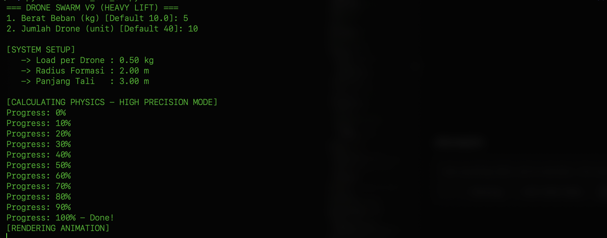

# Drone Simulation

A 3D drone simulation visualizer built with Python. This project demonstrates a drone model rendered in a stylized 3D environment with grid lines and axes.





## Features

- Real-time 3D rendering of a drone model.
- Interactive controls for navigating the scene.
- Clean and modern UI suitable for documentation.

## Usage

```bash
pip3 install -r requirements.txt
```

Run the main script:

```bash
python3 drone_sim_3d.py
```

## License

MIT License.
